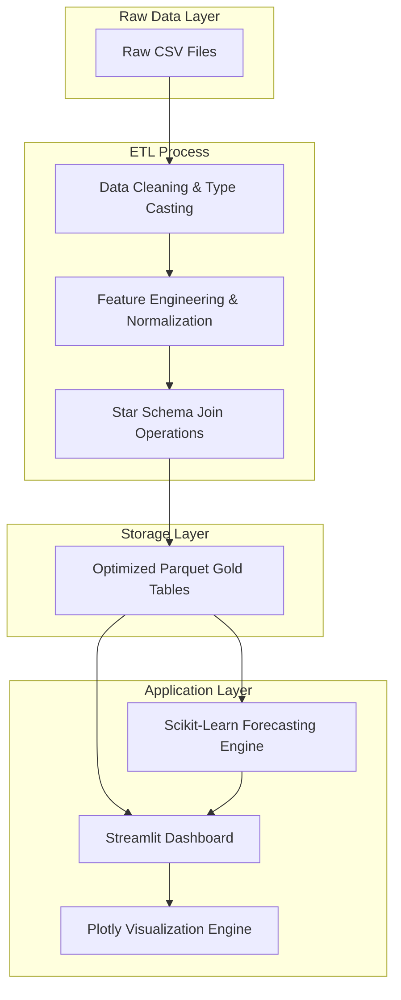

# Executive Business Intelligence Dashboard

A production-grade analytics application designed to deliver real-time insights into E-commerce performance, subscription metrics, and improved forecasting accuracy. Built with a focus on engineering rigor, scalability, and data storytelling.


---

## Architecture & Data Pipeline

The application employs a robust ETL (Extract, Transform, Load) pipeline that normalizes raw CSV data into optimized Parquet "Gold" tables for high-performance querying.



## Key Features

### 1. Financial Analytics
- **Revenue & Margin Analysis**: Real-time tracking of Gross Margin (GM%), Cost of Goods Sold (COGS), and overall Revenue.
- **Subscription Economics**: Insight into Monthly Recurring Revenue (MRR), Annual Recurring Revenue (ARR), and Churn Rates.

### 2. Data Driven Forecasting
- **Predictive Modeling**: Utilizes Scikit-Learn Linear Regression with lag features to project future revenue trends.
- **Seasonality Detection**: Automatically accounts for monthly seasonality and long-term trend components.

### 3. Customer & Marketing Intelligence
- **Cohort Retention**: Heatmap visualization of customer retention over time.
- **Marketing Performance**: Attribution modeling across channels (Organic, Paid, Email) with CAC and ROAS metrics.

---

## Deployment Instructions

### Option 1: Docker
The application is fully containerized for consistency across environments.

```bash
# Build and run the container
docker-compose up --build
```
Access the dashboard at `http://localhost:8501`.

### Option 2: Local Development
For development or debugging purposes.

```bash
# 1. Create a virtual environment
python3 -m venv venv
source venv/bin/activate

# 2. Install dependencies
pip install -r requirements.txt

# 3. Run the application
streamlit run streamlit_app.py
```

## Project Structure

```
.
├── .streamlit/          # Streamlit configuration
├── data/                # Raw and processed data storage
├── src/
│   ├── analytics/       # Machine learning & forecasting modules
│   ├── metrics/         # Core business logic and KPI calculations
│   ├── style/           # Custom CSS assets
│   ├── etl.py           # ETL pipeline orchestration
│   └── utils.py         # Shared utility functions
├── Dockerfile           # Production container specification
├── docker-compose.yml   # Container orchestration
├── requirements.txt     # Pinned dependencies
└── streamlit_app.py     # Application entry point
```


